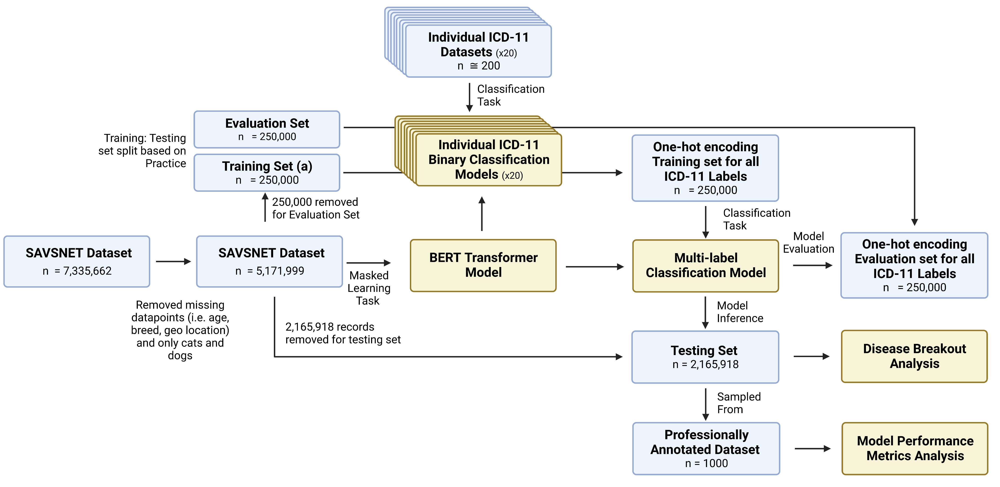

# PetBERT

PetBERT is a masked language model based on the BERT architecture further trained on over 500 million additional words from first-opinion veterinary clinicians from across the UK


Huggingface Link: 


## Abstract
Effective public health surveillance requires consistent monitoring of disease signals such that researchers and decision-makers can react dynamically to changes in disease occurrence. However, whilst surveillance initiatives exist in production animal veterinary medicine, comparable frameworks for companion animals are lacking. First-opinion veterinary electronic health records (EHRs) have the potential to reveal disease signals and often represent the initial reporting of clinical syndromes in animals presenting for medical attention, highlighting their possible significance in early disease detection. Yet despite their availability, there are limitations surrounding their free text-based nature, inhibiting the ability for national-level mortality and morbidity statistics to occur. This paper presents PetBERT, a large language model trained on over 500 million words from 5.1 million EHRs across the UK. PetBERT-ICD is the additional training of PetBERT as a multi-label classifier for the automated coding of veterinary clinical narratives with the \emph{International Classification of Disease 11} framework, achieving F1 scores exceeding 83\% across 20 disease codings with minimal annotations. PetBERT-ICD effectively identifies disease outbreaks, outperforming current clinician-assigned point-of-care labelling strategies up to three weeks earlier. The potential for PetBERT-ICD to enhance disease surveillance in veterinary medicine represents a promising avenue for advancing animal health and improving public health outcomes.

## Training Pipeline



# Instruction
1) Install requirements.txt
## Training PetBERT (MLM/NSP)
**n.b** ensure your dataset is in csv format with the text column named 'text'

Default Parameters:

  Epochs : Early Stopping Enabled,
  Batch_size = 32,
  
  mlm_probability = 0.25, 
  
  weight_decay=0.01, 
  
  initial_learning_rate = 2e-5
  

```
python PetBERT_trainer.py --base_model bert-base-uncased --train_set data/train.csv --eval_set data/eval.csv 
```

Model will be saved in models/PetBERT

## Training Binary Classifiers
Here binary classifiers are trained based on the datasets available within the data/binary folder. If a train and test set are present a binary classifier will be trained and saved to model/binary

```
python binary_classification.py --pretrained_model models/PetBERT --dataset_dir data/binary/
```

## Merging Datasets
```
python dataset_merge.py --binary_model_folder data/binary --save_dir data/PetBERT_ICD/combined
```

## Training Multi Label Classifier (PetBERT-ICD)
```
python PetBERT_ICD_Trainer.py --binary_model_folder data/binary --save_dir data/PetBERT_ICD/combined
```
